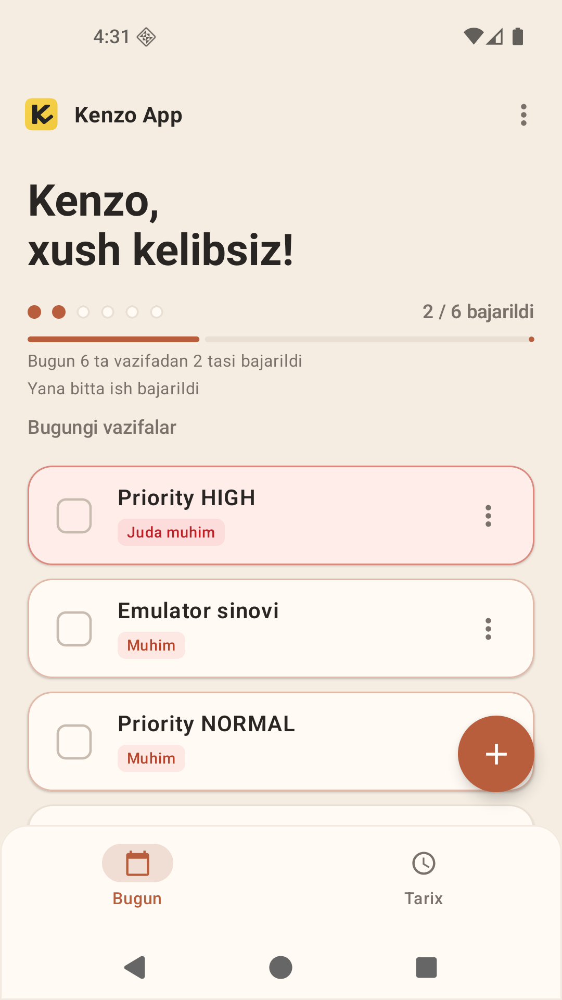
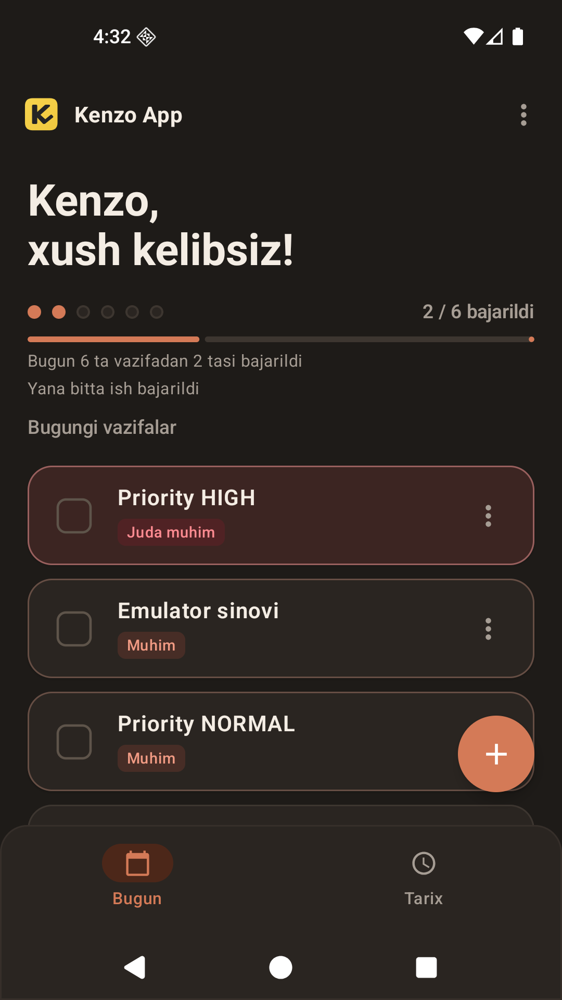
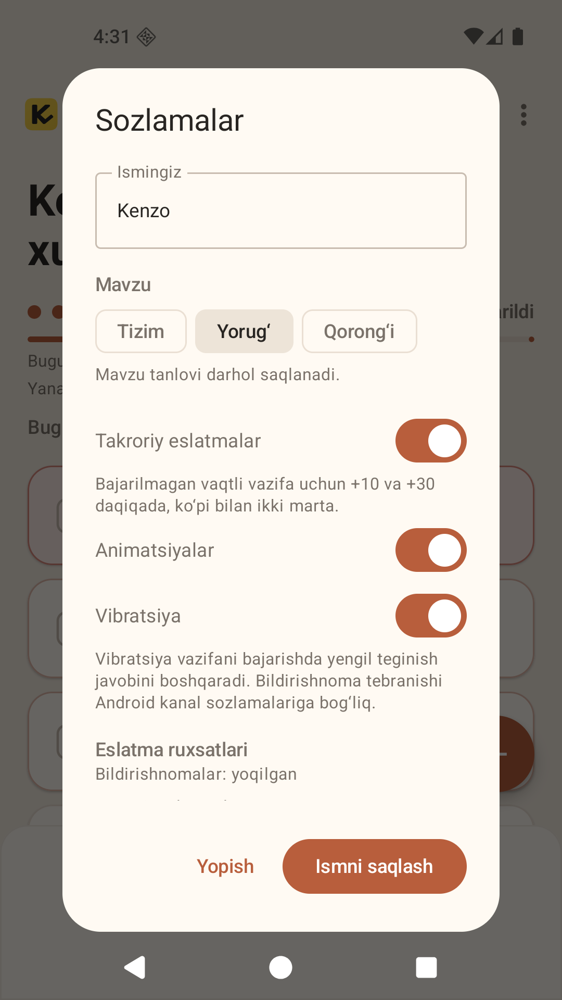

# Kenzo App

An offline Android planner with an Uzbek interface. Save today's tasks, choose an optional time, and keep earlier days in a separate history.

**Development status: Unreleased fixes.** The resumed workspace already contained **1.2.0 / 3**, the warm minimal design, a bottom-sheet time picker and a 1.2.0 APK. Current keyboard/theme/accessibility fixes are debug-only; that existing APK was not rebuilt and does not contain these fixes. Version and signing keys are preserved. [Current checks](docs/UNRELEASED-VERIFICATION.md) · [Security audit](docs/SECURITY-AUDIT.md).

[O'zbekcha README](README.uz.md) · [Verification](docs/VERIFICATION.md) · [Three-agent review](docs/REVIEW.md) · [Changelog](CHANGELOG.md)

## Screenshots

Actual Unreleased screens captured from the running debug app on the project's single Android 16 emulator. Sample tasks were created for verification; no mockups are used.

| Light | Dark |
| --- | --- |
|  |  |



## Features

- Locally saved username, without an account or server.
- Add, edit, complete, restore and delete tasks; deletion requires confirmation.
- Three persisted priorities; higher priorities appear first, then time within each priority. Untimed tasks follow timed tasks at the same priority.
- Previous days grouped in history; copy an earlier task into today without changing the original.
- Persistent **System / Light / Dark** appearance settings.
- Local reminders five minutes before a task, plus optional repeats at +10 and +30 minutes while incomplete. Persisted delivery records prevent replay after restart; expired slots are skipped.
- Notifications open the corresponding task; a private **Bajarildi** action completes it and cancels pending reminders. Opening alone does not complete it.
- Today's completion count and progress; subtle 200 ms motion, optional completion haptics, and stored animation/vibration settings that respect system controls.
- Official K/checkmark adaptive and legacy icons; standard Android splash with light/dark backgrounds and no artificial delay.
- Warm minimal palette and a scrollable bottom-sheet time picker with cumulative +15/+30/+60-minute shortcuts, custom time and an untimed option.
- Permission status and recovery actions in Settings.
- Data-preserving APK updates using the same package ID and signing key.

The current warm minimal design uses cream/beige surfaces, terracotta controls, calm green completion marks and the official yellow logo. It preserves the reference's bold typography and rounded cards.

## Stack

Kotlin · Jetpack Compose · Material 3 · ViewModel/StateFlow · coroutines · SQLite · SharedPreferences · AlarmManager

```text
app/src/main/java/com/example/kunlikvazifalar/
  data/          SQLite, task repository, user/theme preferences
  notification/  Permission-aware scheduling, delivery and restoration
  theme/         Light/dark palettes
  ui/            Screens, dialogs and state management
  util/          Date/time formatting and reminder calculations
```

Minimum Android: **7.0 / API 24**. Target and compile SDK: **36**.
The app has no Internet permission or backend. Android backup settings are separate from offline storage; this is not an encrypted vault.

## Run and build

On the configured Windows workstation:

```powershell
powershell -NoProfile -ExecutionPolicy Bypass -File .\run-android.ps1
```

This reuses `Kenzo_API_36`, builds debug, updates with `adb install -r` and opens the app. Add `-EmulatorOnly` to open only the emulator. See [Android development](ANDROID-DEVELOPMENT.md) for setup.

Elsewhere, install Android SDK platform 36 and build tools, configure `sdk.dir` in untracked `local.properties`, and use a compatible JDK for Gradle/AGP. The project requests a Java 17 toolchain.

```powershell
.\gradlew.bat :app:assembleDebug :app:testDebugUnitTest
.\gradlew.bat :app:connectedDebugAndroidTest
```

Existing signed APK: **[kenzo-app-1.2.0.apk](kenzo-app-1.2.0.apk)**, already present on resume: `versionName=1.2.0`, `versionCode=3`, package `com.example.kunlikvazifalar`. It predates the current Unreleased fixes. No new release was generated in this continuation. [Earlier 1.1.0](kenzo-app-1.1.0.apk) remains available as a historical build.
Release signing uses the existing private keystore configured by untracked `keystore.properties`. Never commit keys/passwords. Debug and release certificates differ: keep the same signing track for in-place updates.

## Quality and limits

The [verification report](docs/VERIFICATION.md) distinguishes performed checks from remaining limitations. One API 36 emulator does not establish physical-device, older-Android or OEM battery-management coverage. Reminder delivery also depends on Android permissions and power management.

Version policy: patch for fixes, minor for compatible features, major for breaking changes; increment `versionCode` for every published APK. Theme selection advances the initial **1.0.0 verification build** to **1.1.0**.
